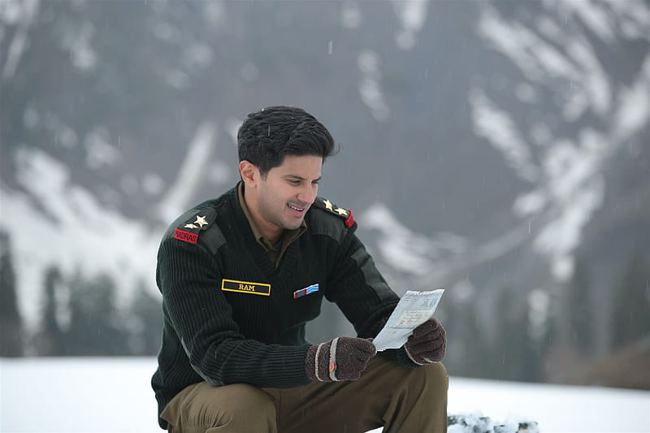

# PraneethaReddy Lakkam
### MY favorite movie
One of my favorite movie is *Sita Ramam*. It's a beautiful blend of romance, drama, and historical elements. The story follows the love between Lieutenant Ram and Sita, set against the backdrop of war, and explores themes of sacrifice, duty, and devotion. What I love most about the film is how it portrays love in a pure and emotional way. The performances by Dulquer Salmaan and Mrunal Thakur are outstanding, and the cinematography is simply breathtaking. It’s a movie that stays with you long after it ends, with its soulful music and heartwarming story.

